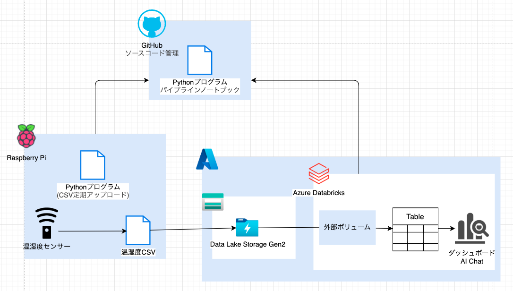

## アーキテクチャ図

## 開発の過程（Qiita記事）

- [Raspberry Pi 5とDHT-11で温度・湿度を計測する](https://qiita.com/ballemech/items/b8cd6165fbb7187b5e78)
- [Azure DatabricksのUnity Catalogでカタログを使えるようにするまで](https://qiita.com/ballemech/items/0b77b159aba6d27f5ab6)
- [RaspberryPiで計測した気温室温データをAzure Databricksのボリュームに定期アップロード](https://qiita.com/ballemech/items/22e31dea041498d1326f)
