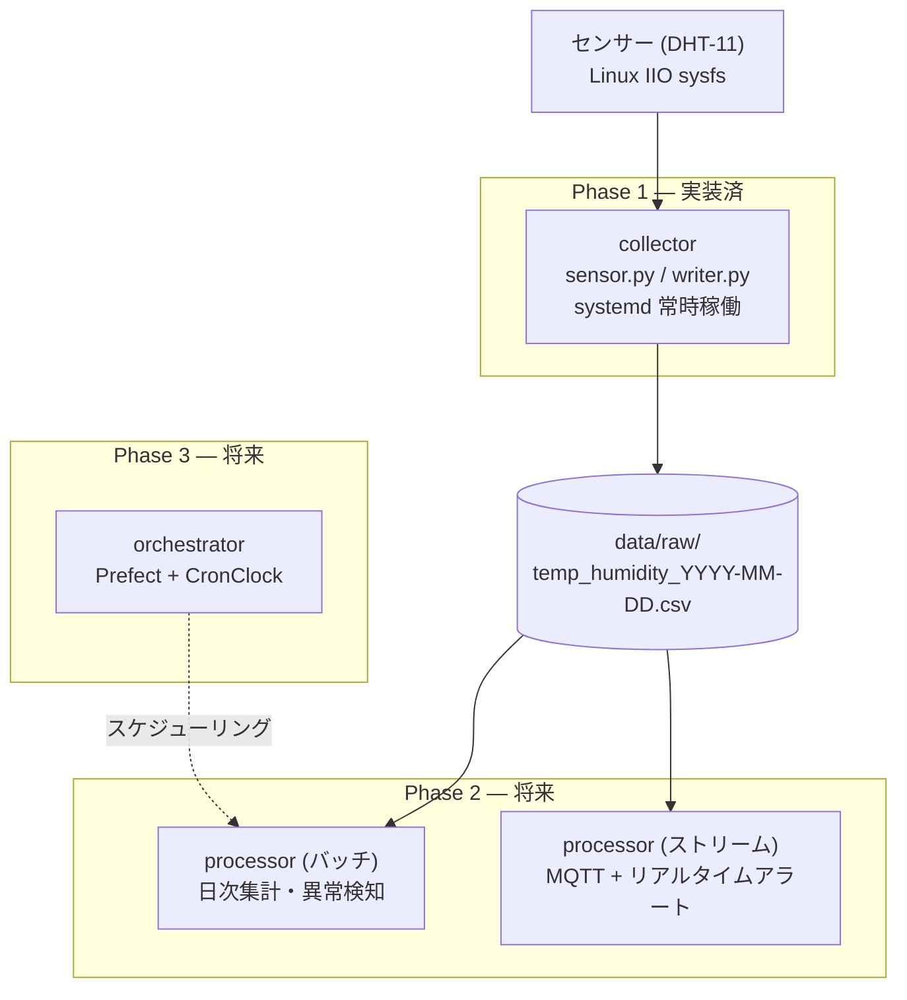

## アーキテクチャ図

```mermaid
graph TD
    SENSOR["センサー (DHT-11)\nLinux IIO sysfs"]

    subgraph PH1["Phase 1 — 実装済"]
        COLLECTOR["collector\nsensor.py / writer.py\nsystemd 常時稼働"]
    end

    CSV[("data/raw/\ntemp_humidity_YYYY-MM-DD.csv")]

    subgraph PH2["Phase 2 — 将来"]
        BATCH["processor (バッチ)\n日次集計・異常検知"]
        STREAM["processor (ストリーム)\nMQTT + リアルタイムアラート"]
    end

    subgraph PH3["Phase 3 — 将来"]
        ORCH["orchestrator\nPrefect + CronClock"]
    end

    SENSOR --> COLLECTOR
    COLLECTOR --> CSV
    CSV --> BATCH
    CSV --> STREAM
    ORCH -.->|スケジューリング| BATCH
```

## 開発の記録（Qiita記事）

開発初期はクラウド（Azure Databricks）をシンクとして使っていましたが、
ローカル完結・段階的拡張を重視する現在のアーキテクチャに方針転換しました。
記事はその変遷を含む記録として残しています。

**Phase 0 — センサー計測の立ち上げ**
- [Raspberry Pi 5とDHT-11で温度・湿度を計測する](https://qiita.com/ballemech/items/b8cd6165fbb7187b5e78)

**旧構成 — Azure Databricks をシンクとして利用（現アーキテクチャには含まれない）**
- [Azure DatabricksのUnity Catalogでカタログを使えるようにするまで](https://qiita.com/ballemech/items/0b77b159aba6d27f5ab6)
- [RaspberryPiで計測した気温室温データをAzure Databricksのボリュームに定期アップロード](https://qiita.com/ballemech/items/22e31dea041498d1326f)
